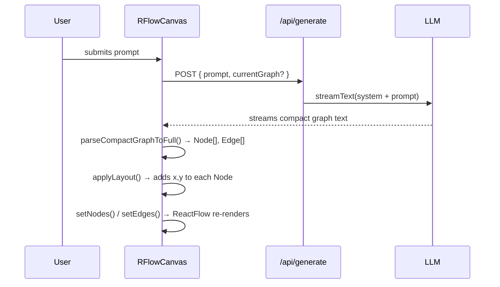

# App Execution Flow

```mermaid
sequenceDiagram
    participant U as User
    participant RF as RFlowCanvas
    participant API as /api/generate
    participant AI as LLM

    U->>RF: submits prompt
    RF->>API: POST { prompt, currentGraph? }
    API->>AI: streamText(system + prompt)
    AI-->>RF: streams compact graph text
    RF->>RF: parseCompactGraphToFull() → Node[], Edge[]
    RF->>RF: applyLayout() → adds x,y to each Node
    RF->>RF: setNodes() / setEdges() → ReactFlow re-renders
```
