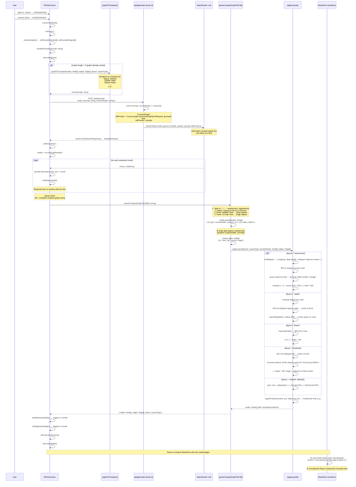

# App Execution Flow

```mermaid
sequenceDiagram
    participant U as User
    participant RF as RFlowCanvas
    participant GC as graphToCompact()
    participant API as /api/generate (route.ts)
    participant AI as OpenRouter LLM
    participant PC as parseCompactGraphToFull()
    participant AL as applyLayout()
    participant RFlow as ReactFlow (renderer)

    U->>RF: types in <input> → setInput(string)
    U->>RF: presses Enter → handleSubmit(e)

    RF->>RF: e.preventDefault()
    RF->>RF: setInput('')
    RF->>RF: clearExamples() → setExampleNodes([]), setExampleEdges([])
    RF->>RF: handleGenerate(prompt: string)
    RF->>RF: setLoading(true)

    alt nodes.length > 0  (graph already exists)
        RF->>GC: graphToCompact(nodes: Node[], edges: Edge[], layout: LayoutType)
        Note over GC: Serializes to compact text:<br/>"layout: network<br/>1|Node Label<br/>2|Other Node<br/>---<br/>1>2"
        GC-->>RF: currentGraph: string
    end

    RF->>API: POST /api/generate<br/>body: { prompt: string, currentGraph?: string }

    API->>API: const { prompt, currentGraph } = req.json()
    Note over API: if currentGraph:<br/>  fullPrompt = "Current graph:\n{currentGraph}\n\nRequest: {prompt}"<br/>else:<br/>  fullPrompt = prompt

    API->>AI: streamText({ model: gemini-3.5-flash, system, prompt: fullPrompt })
    Note over AI: Generates compact graph text<br/>one token at a time

    API-->>RF: result.toTextStreamResponse() → ReadableStream

    RF->>RF: setResponse('')
    RF->>RF: reader = res.body.getReader()

    loop for each streamed chunk
        AI-->>RF: chunk: Uint8Array
        RF->>RF: decoder.decode(chunk), full += chunk
        RF->>RF: setResponse(full)
        Note over RF: Response box re-renders with live text
    end

    Note over RF: stream done<br/>full = complete compact graph string

    RF->>PC: parseCompactGraphToFull(full: string)

    Note over PC: 1. Split on "---" → nodeSection, edgeSection<br/>2. Match /^layout:\s*(\w+)/ on first line<br/>3. Parse "id|label" lines → Node objects<br/>4. Parse "src>tgt" lines → Edge objects

    PC->>PC: create parsedNodes: Node[]<br/>{ id, type: 'canvasNode', position: {x:0, y:0}, data: { label } }
    Note over PC: ⬆ Node data objects created here<br/>(position is placeholder, not final)

    PC->>PC: create edges: Edge[]<br/>{ id: "eSrc-Tgt", source, target }

    PC->>AL: applyLayout(layout: LayoutType, parsedNodes: Node[], edges: Edge[])

    alt layout = 'hierarchical'
        AL->>AL: buildMaps() → { outgoing: Map<id,id[]>, indegree: Map<id,number> }
        AL->>AL: BFS to assign level per node
        AL->>AL: group nodes by level → byLevel: Map<number, string[]>
        AL->>AL: compute x = (i - (count-1)/2) * 350, y = level * 250
    else layout = 'radial'
        AL->>AL: compute degree per node
        AL->>AL: find hub (highest-degree node) → center at {0,0}
        AL->>AL: placeRing(others, radius=500) → evenly space on circle
    else layout = 'linear'
        AL->>AL: traversalOrder() → BFS from roots
        AL->>AL: x=0, y = index * 150
    else layout = 'mindmap'
        AL->>AL: find root (indegree=0) → center at {0,0}
        AL->>AL: recursive place(): divide angular sector [0, 2π] among children
        AL->>AL: r = depth * 450, angle = midpoint of child's sector
    else layout = 'network' (default)
        AL->>AL: grid: cols = ceil(sqrt(n)), x = (i%cols)*400, y = floor(i/cols)*400
    end

    AL->>AL: applyPositions(nodes, pos: Map<id,{x,y}>) → Node[] with final (x,y)
    AL-->>PC: nodes: Node[] (with computed positions)

    PC-->>RF: { nodes: Node[], edges: Edge[], layout: LayoutType }

    RF->>RF: setNodes(newNodes)   ← triggers re-render
    RF->>RF: setEdges(newEdges)   ← triggers re-render
    RF->>RF: setLayout(newLayout)
    RF->>RF: setLoading(false)

    Note over RF,RFlow: React re-renders ReactFlow with new nodes/edges
    RFlow->>RFlow: for each Node where type='canvasNode':<br/>renders <CanvasNode id={id} data={{ label }} />
    Note over RFlow: ⬆ CanvasNode React components mounted here
```

